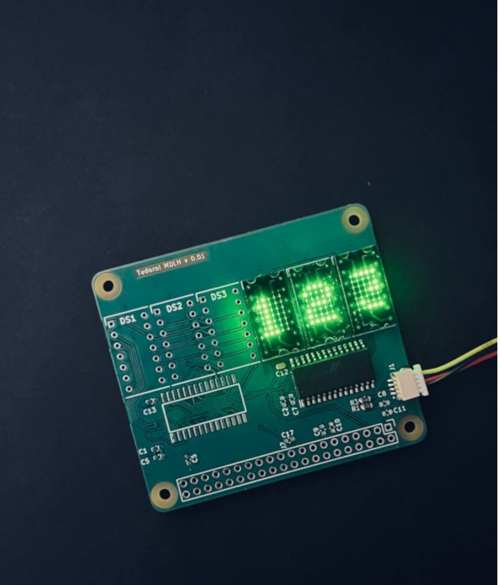
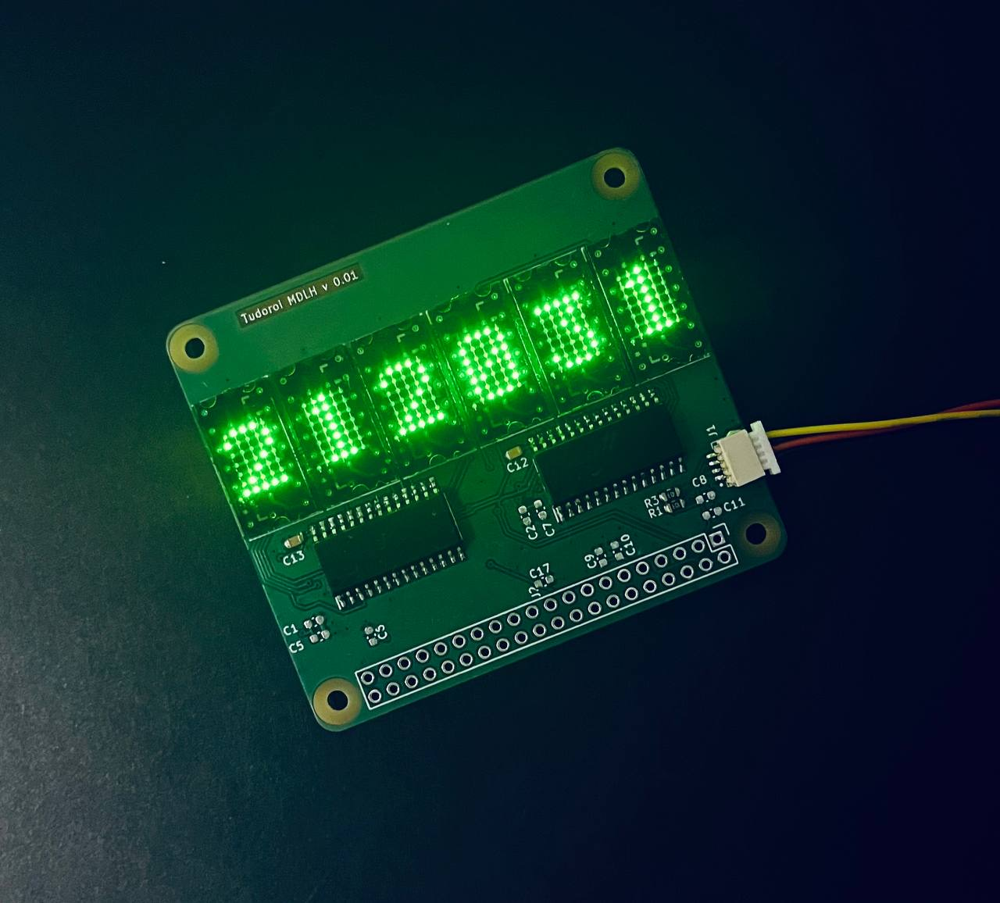

# Pitanga Project


Prototype 0.01            |  Pitanga V1 |  Pitanga V2.1a
:-------------------------:|:-------------------------:|:-------------------------:
  |    | 

<!-- # Prototype A 
```LTP-305G```

 
# First version 
```ALS340A1 installed``` 


Als340A1 and ALS340A

ALS340A, ALS230A1, LTP305R, LTP305G

ALS340A1

# Version 2.1a
```LTP 305R```
 -->


## Overview


Welcome to the Pitanga project, my very first PCB design endeavor using KiCad 7.0. This project served as a significant learning experience, allowing me to delve into the world of PCB design, Raspberry Pi extension hats, and various hardware components.

## Key Milestones

- **PCB Manufacturing:**
  - Initiated with the ordering of the first PCBs (0.01 and 1.0 versions) from PCBWay, marking the beginning of the project.
  - Subsequently transitioned to JLCPCB for future revisions, benefiting from their commendable PCB quality and competitive pricing.

- **Evolution of Design:**
  - Progressed from a 2-layer PCB in version 0.01 to a more complex 4-layer design in version 1.0.
  - Experimented with a DC-DC converter in version 2.0, only to return to the simplicity of 2 layers in version 2.1.

- **Technological Exploration:**
  - Introduced the utilization of the HT16K33 driver and various LED 5x7 displays.
  - Integrated a set of 5 tactile buttons into the design, establishing a connection with the HT16K33 driver.
  - Expanded the project to include diverse LED displays, ranging from MAN2 to the latest respins of Til-305, encompassing even USSR variants.

-  **Supported Displays:**

    - The Pitanga  supports a variety of displays, including but not limited to:
        - Monsanto MAN 2
        - IEE - LRT1704R
        - DIALCO 745-0005
        - LTEON LTP-305
        - TI Til-305
        - ALS340A
        - ALS340A1
        - 3LS340
        - 3LS363
        - AL104
        <!--  -->
## Learning Journey

The Pitanga project encapsulates my journey in PCB design in KiCad 7.0. 
Each version of the board represents a step forward in understanding, incorporating new features, and refining the overall design.

